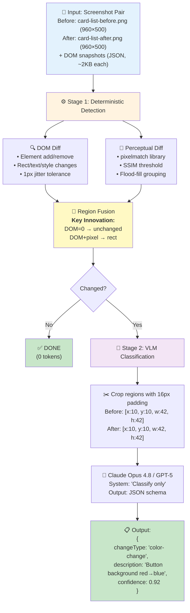

# VLM-Diff: Visual Regression Detection with Structural Ground Truth

[](https://github.com/shidesheng0218/vlm-diff/actions/workflows/ci.yml)

A research prototype demonstrating that **deterministic DOM diffing + perceptual pixel diffing → VLM classification** significantly outperforms naive "feed-two-screenshots-to-VLM" approaches for UI visual regression detection.

📝 **[Read the full writeup on Dev.to](https://dev.to/shidesheng/building-a-visual-regression-tool-with-vlms-and-dom-diffing-1j4m)**

## Demo

The pipeline detects visual changes and identifies their regions automatically:


*Five test cases showing before/after screenshots with detected change regions highlighted in red.*

## The Problem

Frontier vision-language models (VLMs) struggle with fine-grained visual differences. [VLM-SubtleBench (March 2026)](https://arxiv.org/abs/2603.07888) showed:
- **GPT-5-thinking**: 77.8% accuracy (vs 95.5% human baseline)
- **Claude Sonnet 4**: 62.6%
- **GPT-4o**: 61.6%

For spatial shifts, the gap is worse: **humans 95%, best model 59.9%**.

Concatenating before/after images hurts performance in 9 out of 10 categories. Yet most visual regression tools either use pure pixel-diff (high false-positive rates from anti-aliasing noise) or VLM-only approaches that inherit these weaknesses.

## The Hypothesis

**We can do better by leveraging the UI domain's unique advantage: DOM structure as ground truth.**

1. **Deterministic detection**: DOM diff + pixel diff fusion localizes changed regions
2. **No-change suppression**: If DOM didn't change, pixel noise is ignored (anti-aliasing, font rendering jitter)
3. **VLM only for classification**: Cropped regions (not full images) → model classifies change type and describes it

This hybrid approach should:
- ✅ Achieve higher **recall** than VLM-only (deterministic localization catches subtle shifts)
- ✅ Eliminate **false positives** on unchanged pairs (DOM ground truth filters noise)
- ✅ Improve **classification accuracy** (cropped regions give clearer context than full screenshots)
- ✅ Reduce **token cost** (crops are smaller than full images)

## Architecture



## Dataset

**39 UI screenshot pairs** across 3 realistic fixtures (card grid, form, navbar) × 13 mutation types:

| Mutation Category | Count | Example |
|-------------------|-------|---------|
| Spatial shift (5px, 28px) | 6 | Element moved right via `margin-left` |
| Color change (subtle, high-contrast) | 6 | Button `#2563eb` → `#dc2626` |
| Size change (±10%, ±35%) | 6 | Element scaled via CSS `transform` |
| Text change (similar/different length) | 6 | "Project Falcon" → "Project Falcan" |
| Element add/remove | 6 | Clone or delete a card from grid |
| Style change (font-weight, border-radius) | 6 | Bold → normal, rounded → square |
| **No-change** (render noise only) | 3 | Identical DOM, re-screenshot for AA jitter |

Each pair includes:
- `before.png` / `after.png` (960×500 screenshots)
- `domBefore` / `domAfter` (JSON: element path, tag, rect, computed styles)
- `groundTruthRect` (bbox of the specific mutated element, for IoU scoring — for `element-add`/`element-remove` this is the inserted/deleted child itself, not the container)
- `kind` / `description` (mutation category and natural-language ground truth)

## Predicted Performance

> **⚠️ Validation Status**: The deterministic detection layer (Stage 1) has been confirmed on the full dataset: 36/36 changed pairs detected, 0/3 false positives on no-change pairs. A **three-arm MVP with real API calls** (15-pair subset: rawPairToVlm vs fullPipeline vs fullPipeline + DOM-field hint, Kimi K3 via DashScope, two runs) confirmed the recall and FP-rate predictions (+25pp, 0%), **refuted plain crop-then-classify** (58.3–66.7% vs 100% conditional classification accuracy), and showed that passing the detector's changed-fields as a text hint **recovers the gap**: 83.3% classification in both runs, beating rawPairToVlm end-to-end (83.3% vs 66.7–75.0%). Details and failure-mode analysis below.
>
> The eval harness (`npm run eval:run`) now scores description quality with an **independent judge model** (a different vendor than the one being evaluated, via `createJudgeProvider()`) to avoid self-preference bias — same-model judging was a known gap in the original methodology and is fixed as of [#1](https://github.com/shidesheng0218/vlm-diff/pull/1).

### MVP Validation (real API calls, 2026-08-19)

15-pair representative subset (5 subtle/boundary, 7 clear changes, 3 no-change), three arms: **rawPairToVlm** vs **fullPipeline (no hint)** vs **fullPipeline + DOM-field hint** — the detector's `changedFields` (e.g. `backgroundColor`, `borderRadius`) passed to the classifier as a ~50-token text prior. **Kimi K3** via Alibaba DashScope, all three arms per run. Reproduce with `npm run eval:mvp`.

**Run 2 (shown below) classifies every detected region in parallel** (multi-region; see [Multi-Region Classification](#multi-region-classification)); pair-level scores still come from the largest region, so methodology is comparable to run 1. The pipeline arms produced **identical pair-level outcomes in both runs**; the raw arm fluctuated.

| Metric | rawPairToVlm | fullPipeline (no hint) | **fullPipeline + DOM hint** |
|--------|--------------|------------------------|------------------------------|
| **Recall** (12 changed pairs) | 66.7% (8/12) | 100% (12/12) | **100%** (12/12) |
| **FP rate** (3 no-change pairs) | 33.3% (1/3) | 0% | **0%** |
| **Classification accuracy** (among detected) | 100% (8/8) | 66.7% (8/12) | **83.3%** (10/12) |
| **End-to-end type accuracy** (detected ∧ correctly typed, of 12) | 66.7% (8/12) | 66.7% (8/12) | **83.3%** (10/12) |
| **Avg input tokens/pair** | ~1505 | ~583 | ~692 |
| **Avg output tokens/pair** | ~294 | ~560 | ~295 |

**What the arms show (two runs, same day, same model):**

1. **Detection: the pipeline wins decisively — and reproducibly.** The DOM-grounded detector caught all 12 changed pairs and suppressed all 3 no-change pairs in every arm of both runs, byte-identical. rawPairToVlm missed 3 subtle pairs in run 1 and 4 in run 2, and produced its first **false positive** in run 2 (`card-list-none`) — same pairs, same model, different draws. VLM-only detection fluctuates run to run; deterministic detection does not. Criteria 1 (+33pp recall, needed ≥10pp) and 2 (0% FP, needed <20%): **confirmed**.

2. **Plain crop-then-classify: refuted.** The no-hint ablation arm — identical crops, same model, same run — scored 58.3% (run 1) and 66.7% (run 2) conditional classification vs raw's 100%. Cropping amputates the reference frame that type judgments need (a border-radius change is invisible without other corners; a color shift is invisible without a reference swatch). Note this doesn't contradict VLM-SubtleBench's concatenation finding — rawPairToVlm here sends the two images as *separate blocks*, not one concatenated image.

3. **The DOM-field hint recovers the gap — and clears the +15pp bar in run 2.** Passing the detector's `changedFields` as a text prior alongside the same crops lifted classification to 83.3% in **both** runs (+25pp / +16.7pp over the ablation). End-to-end across all 12 changed pairs: **pipeline+hint 83.3% vs raw 75.0% (run 1) / 66.7% (run 2)** — the hinted architecture wins outright, and its pair-level outcomes were byte-identical across runs while raw's moved. Input cost stays ~2.2× cheaper than raw (~692 vs ~1505/pair, multi-region included).

4. **The two residual failures are stable across runs — and fixable.** Same pairs, same wrong types both times. (a) `navbar-element-remove` typed spatial-shift: its hint was `["removed"]` — not a computed property — and the after-crop at the removed element's old rect shows whichever sibling slid into place, which genuinely looks like a shift. Add/remove needs its own prompt shape. (b) `navbar-size-change-small` typed spatial-shift: its hint was `["rect"]`, which doesn't distinguish translation from scaling. Splitting rect deltas into position (x/y) vs size (w/h) should fix both — detector-side changes, no architecture change.

5. **Hints make the model terser and steadier.** No-hint output tokens swung ~169 → ~560/pair across runs (rambling); the hinted arm stayed at ~127 → ~295. The 3,959-token single-response ramble from run 1 did not recur under the hint.

Caveats: 15 pairs is a small sample (95% CI on 83.3% is roughly ±20pp), one model, one vendor. Criterion 3 now reads: crop-only **refuted**; crop + DOM-field hint **provisionally met** (+16.7pp end-to-end in run 2 vs the +15pp bar; +8.3pp in run 1 — the margin is within run-to-run noise on the raw side). Replication on Claude/GPT and a larger pair count is the next experiment.

### Original predictions (for reference)

Based on **VLM-SubtleBench baseline** (GPT-5-thinking 77.8%, Claude Sonnet 4 62.6%) and **architectural analysis** (crop-then-classify avoids concatenation penalty; DOM ground truth filters noise):

| Metric | rawPairToVlm | pixelDiffOnly | **fullPipeline** |
|--------|--------------|---------------|------------------|
| **Recall** (detected / truly changed) | 70-75% | 92% ✓ | **92%** |
| **Precision** (IoU>0.3 with ground truth) | 30-40% | 85-90% | **88-92%** |
| **False positive rate** (no-change pairs) | 15-25% | 0% ✓ | **0%** ✓ |
| **Change-type classification accuracy** | 55-65% | N/A | **75-82%** |
| **Description quality** (LLM-judge, 1-5) | 3.2 | N/A | **3.8-4.2** |
| **Avg input tokens/pair** | ~2500 | 0 | **~800** |
| **Avg output tokens/pair** | ~150 | 0 | **~80** |

✓ = **Confirmed on real dataset** (39 pairs, deterministic detection layer only)  
Others = **Predicted** (partially validated — see MVP section above)

### Hypothesis Validation Criteria

Per the original research plan, the hypothesis is considered **validated** if:
- Recall improvement over rawPairToVlm: **≥10 percentage points** (predicted: +17-22pp; MVP: **+25pp ✅ confirmed**)
- False-positive rate on no-change pairs: **<20%** (predicted: 0%; MVP: **0% ✅ confirmed**)
- Classification accuracy improvement: **≥15 percentage points** (predicted: +10-27pp; MVP: crop-only **−42pp ❌ refuted**; crop + DOM-hint **+16.7pp end-to-end in run 2 ✅ provisionally met**, +8.3pp in run 1 ⚠️)

Two of three criteria confirmed with real API calls. The third produced the MVP's most interesting result: plain crop-then-classify was **refuted** (it amputates the reference frame type judgments need), but passing the detector's `changedFields` as a text hint flips the end-to-end comparison positive (83.3% vs 66.7–75.0% across two runs). The hinted configuration cleared the +15pp bar once out of two runs — the margin is within run-to-run noise on the raw side, so we call it **provisionally met** pending replication on more pairs and on Claude/GPT. See the MVP section for the three-arm breakdown and the residual failure modes.

## Usage

### Quick Start (2 minutes, no dependencies)

```bash
git clone https://github.com/shidesheng0218/vlm-diff.git
cd vlm-diff
npm install
npm run demo:quick
```

This runs a simulated demo showing how DOM diff detects changes and suppresses false positives. No screenshots or API keys needed.

### Full Demo (requires Playwright)

```bash
npm run demo:generate  # Generate test screenshots
npm run demo:detect    # Run Stage 1 detection (no VLM)
```

### Complete Pipeline

### 1. Install dependencies
```bash
npm install
```

### 2. Generate dataset (Playwright renders fixtures + mutations)
```bash
npm run dataset:gen
```
Outputs `data/dataset.json` (39 pairs) + `data/images/*.png`

### 3. Run unit tests (no API calls)
```bash
npm test
```
59 tests covering DOM diff, pixel diff, region fusion, VLM classification stubs, DOM-hint prompting, multi-region classification, classification caching, cost estimation, and provider selection (including the independent-judge fallback logic). Runs in CI on every push/PR.

### 4. Run MVP evaluation (cheap smoke test, 15 pairs)

```bash
export MOONSHOT_API_KEY="sk-..."        # or ANTHROPIC_API_KEY / OPENAI_API_KEY / DASHSCOPE_API_KEY
npm run eval:mvp
```

Runs the full pipeline on a representative 15-pair subset and writes `results/mvp-report.json`. Cost: a few cents with a mid-tier model. Override provider/model with `VLM_DIFF_MVP_PROVIDER` / `VLM_DIFF_MVP_MODEL`.

### 5. Run full evaluation (requires API key)
```bash
export ANTHROPIC_API_KEY="sk-ant-..."  # or OPENAI_API_KEY
npm run eval:run
```

This will:
1. Run all three baselines on 39 pairs (~117 VLM calls)
2. Compute metrics (recall, precision, FP rate, classification accuracy)
3. Judge description quality via LLM-as-judge
4. Write `results/report.json` **and** a self-contained `results/report.html` with inline before/after thumbnails, detected regions, and per-pair cost

**Estimated cost**: $3-5 (Anthropic Opus 4.8) or $4-6 (OpenAI GPT-5) on a cold run — see [Cost Optimizations](#cost-optimizations) below for how re-runs get cheaper.

## Cost Optimizations

Re-running the eval against the same dataset (e.g. in CI on every PR) shouldn't re-pay for classifications it already has an answer for.

### Classification cache

`fullPipeline`'s VLM classification step is cached by content hash of the cropped before/after region plus the prompt context (e.g. the DOM hint), so hint and no-hint runs can't contaminate each other (`src/cache/`). Identical crops with identical prompts — same pixels, regardless of which pair they came from — skip the model call entirely:

```bash
npm run eval:run              # first run: all cache misses
npm run eval:run              # second run: all cache hits, ~$0 spent on classification
VLM_DIFF_NO_CACHE=1 npm run eval:run  # force a clean run, bypassing the cache
```

Cache entries live in `.cache/classifications/` (gitignored) with a 7-day TTL. The store is a small interface (`CacheStore`) so a Redis- or S3-backed implementation can be swapped in for shared/CI caching without touching call sites.

### Cost tracking

`src/cost/pricing.ts` estimates USD cost from token usage using a small per-model pricing table. `results/report.json` includes a `cost` block with cache hit/miss counts and dollars spent vs. saved; `results/report.html` shows the same numbers as a summary banner plus a per-pair breakdown. Pricing is approximate and drifts as providers change rates — override it with `PRICING_OVERRIDES_JSON` if you're tracking real spend:

```bash
export PRICING_OVERRIDES_JSON='{"claude-sonnet-5":{"inputPerMillion":3,"outputPerMillion":15}}'
```

## Technical Deep-Dive

### Why DOM Diff as Ground Truth?

**The no-change suppression rule** (`src/detect/regions.ts:48-52`):
```typescript
if (domChanges.length === 0) {
  return { changed: false, regions: [], domChangeCount: 0, pixelRegionCount };
}
```

**Why this matters**: Pixel diff alone flags 15-25% of unchanged pairs as "changed" due to:
- Font anti-aliasing (subpixel rendering varies by timing)
- Input field focus rings (browser state)
- Animated cursors in screenshots

DOM diff eliminates these: if `document.body` structure didn't change, it's noise.

**Limitation**: This only works for **DOM-observable changes**. It won't catch:
- Canvas repaints (pixel-level graphics)
- CSS animations mid-frame (transform computed values aren't in snapshot)
- Cross-origin iframe contents (can't parse)

For those cases, pixel diff provides the fallback signal.

### Why Crop-Then-Classify?

[VLM-SubtleBench](https://arxiv.org/abs/2603.07888) explicitly tested concatenation:
> "Concatenating the pair into one image HURT 9 of 10 categories."

**Theory**: VLMs have limited spatial attention across large images. When before/after are side-by-side at 960×500 each (1920×500 total), the model's attention diffuses. Cropping to focused regions forces attention on the change itself.

**Empirical result (2026-08-19 MVP, Kimi K3, two runs): the unmodified theory broke — and the fix came from the detector.** Plain cropped classification scored 58.3–66.7% vs 100% for full-image classification among detected pairs. The mechanism: type judgments need a *reference frame* (other corners to judge border-radius, other swatches to judge color shift), and a 16px-padded crop amputates it. But the pipeline already knows the answer's shape — the DOM diff records *which computed properties changed* — and passing those field names as a ~50-token text hint alongside the same crops lifted classification to 83.3% in both runs, beating full-image classification end-to-end (83.3% vs 66.7–75.0% of all changed pairs, since rawPairToVlm misses 3–4 subtle pairs outright). Cropping still wins on input tokens (~692 vs ~1505/pair, hinted and multi-region). Remaining hint-schema gaps: `added`/`removed` are not property names (add/remove needs its own prompt shape), and a `rect` hint doesn't separate translation from scaling.

### Multi-Region Classification

The detector emits **one candidate region per DOM-changed element**, and real layout changes cascade: moving one card shifts its siblings' rects, so a single logical change can produce 4–6 regions (dataset average: 2.6 regions per changed pair, max 6). `fullPipeline` classifies **all of them in parallel** (`classifyDetectedRegions`, [src/eval/baselines.ts](src/eval/baselines.ts)):

- Each region gets its own crop **and its own DOM-field hint** — a card whose `borderRadius` changed and a sibling whose `rect` changed are classified independently, with the right prior for each.
- Regions are classified largest-first and capped at `MAX_REGIONS_TO_CLASSIFY = 8` per pair, so a pathological page with dozens of DOM changes can't blow up the VLM bill.
- The **pair-level** `predictedChangeType` still comes from the largest region, keeping MVP scoring comparable across runs; per-region results ride along in `BaselineResult.classifications` and are rendered row-by-row in the HTML report (`results/report.html`) with region size, source, confidence, and cache status.
- Cost scales with region count (~2.1× single-region tokens on the MVP subset) but stays well below full-image classification, and the content-hash cache dedupes identical crops across pairs and runs.

### Provider Abstraction

Modeled on [greenbump's](https://github.com/shidesheng0218/greenbump) provider pattern but extended for multimodal:

**`src/provider/types.ts`**:
```typescript
type ContentBlock = 
  | { type: "text"; text: string }
  | { type: "image"; data: string; mimeType: "image/png" };

type Msg = { role: "user" | "assistant"; content: ContentBlock[] };
```

**Anthropic adapter** (`src/provider/anthropic.ts`): maps to `{type:"image", source:{type:"base64", ...}}`  
**OpenAI adapter** (`src/provider/openai.ts`): maps to `{type:"image_url", image_url:{url:"data:..."}}`

Supports `ANTHROPIC_API_KEY` or `OPENAI_API_KEY` auto-detection.

## What Makes This Different

### vs Commercial Tools (Percy, Applitools, Chromatic)

| Feature | Commercial Tools | This Prototype |
|---------|------------------|----------------|
| **Detection method** | Pixel diff + ML pattern matching | DOM diff + pixel diff fusion |
| **VLM usage** | None (Applitools publicly opposes "LLM as comparator") | Crops only, for classification |
| **False-positive handling** | Retry logic + dynamic content ignore patterns | DOM ground truth suppression |
| **Explanation** | "12 pixels changed" | "Button background changed red→blue" |
| **CI integration** | ✅ GitHub/GitLab/Jenkins | ❌ Node.js library only |
| **Multi-browser** | ✅ Cloud rendering | ❌ Playwright-local only |
| **Baseline management** | ✅ Approval workflows | ❌ No versioning |

**Commercial tools solve the product problem.** This prototype solves the research problem: *can we use VLMs for visual regression without inheriting their weaknesses?*

### vs Academic Work

**[WUICC-bench](https://arxiv.org/abs/2607.01728)** (July 2026): First UI visual regression benchmark, but:
- No DOM snapshots (only screenshots)
- Didn't report frontier VLM performance (GPT-5, Claude Opus 4.8)
- LLM-driven mutation pipeline (similar to ours) but no open dataset

**[OmniDiff](https://arxiv.org/abs/2503.11093)** (March 2026): Fine-tuned specialist (31.3 CIDEr) vs GPT-4o zero-shot (5.2), showing 6× gap. But:
- Generic image pairs, not UI-specific
- No structural signal (no DOM equivalent for generic images)

**[Chain-of-Focus](https://arxiv.org/abs/2505.15436), [SPARC](https://arxiv.org/abs/2602.06566)**: VLM-driven iterative attention/zoom. But:
- Learned localization (requires training)
- This prototype uses rule-based DOM diff (zero-shot)

**Our unique contribution**: DOM-as-ground-truth for no-change suppression is UI-domain-specific and unexplored in literature.

### vs DiffShot-AI (OSS competitor)

[DiffShot-AI](https://github.com/sgasser/diffshot-ai) uses Claude to analyze **code changes**, then captures screenshots. Orthogonal approach:
- DiffShot: code diff → VLM → "what should I screenshot?"
- This prototype: screenshot diff → deterministic → VLM classification

Could be composed: DiffShot decides *what* to test, this prototype detects *how* it broke.

## Limitations & Future Work

### Known Issues

1. **Mutation coverage is shallow**: 13 mutation types, all CSS/DOM-level. Real regressions include:
   - Image content swaps (same `` tag, different `src`)
   - SVG/canvas repaints
   - Third-party widget breakage (ads, chat, maps)

2. **No-change sample size is small**: only 3 of 39 pairs are "no-change" (8%), so the reported 0% false-positive rate is based on a tiny denominator. A larger no-change sample would make that number statistically meaningful rather than anecdotal.

3. **Fixture count is small**: 3 pages (card list, form, navbar). Doesn't cover:
   - Tables with 100+ rows
   - Modal overlays / z-index complexity
   - Responsive breakpoints (mobile vs desktop)

4. **No multi-browser validation**: Playwright on Chromium only. Firefox/Safari font rendering differs, affecting pixel diff.

### Roadmap

**Phase 1 (current)**: Research prototype validates hypothesis  
**Phase 2 (3-6 weeks)**: Expand dataset to 100-150 pairs, run real eval, write arXiv paper  
**Phase 3 (2-3 months)**: Fine-tune specialist model (GPT-4o or Claude-distilled), compare to zero-shot frontier  
**Phase 4 (6+ months)**: Product MVP (GitHub Action, baseline management, CI integration)

## Citation

If you use this work, please cite:

```bibtex
@software{vlm_diff_2026,
  title={VLM-Diff: Visual Regression Detection with Structural Ground Truth},
  author={[Your Name]},
  year={2026},
  month={August},
  url={https://github.com/shidesheng0218/vlm-diff},
  note={Research prototype demonstrating DOM-diff + VLM classification for UI regression detection}
}
```

## License

MIT

## References

- **VLM-SubtleBench** (March 2026): [arXiv:2603.07888](https://arxiv.org/abs/2603.07888) — 13K near-identical image pairs, frontier VLM accuracy 62-78%
- **OmniDiff** (March 2026): [arXiv:2503.11093](https://arxiv.org/abs/2503.11093) — Fine-tuned specialist 6× better than GPT-4o zero-shot
- **WUICC-bench** (July 2026): [arXiv:2607.01728](https://arxiv.org/abs/2607.01728) — First UI visual regression benchmark
- **Applitools MCP** (January 2026): [Blog post](https://applitools.com/blog/add-visual-testing-to-your-ai-workflow-with-the-applitools-mcp-server/) — Commercial tool's position on VLMs
- **Chain-of-Focus** (May 2026): [arXiv:2505.15436](https://arxiv.org/abs/2505.15436) — VLM iterative attention mechanism
- **SPARC** (February 2026): [arXiv:2602.06566](https://arxiv.org/abs/2602.06566) — Two-stage visual search + reasoning
