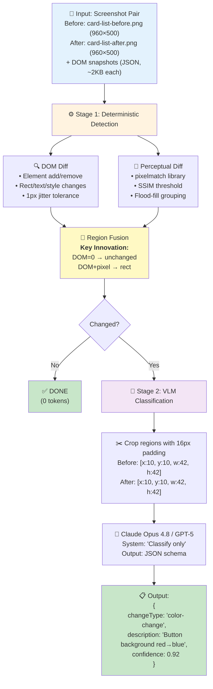

# VLM-Diff: Visual Regression Detection with Structural Ground Truth

[](https://github.com/shidesheng0218/vlm-diff/actions/workflows/ci.yml)

A research prototype demonstrating that **deterministic DOM diffing + perceptual pixel diffing → VLM classification** significantly outperforms naive "feed-two-screenshots-to-VLM" approaches for UI visual regression detection.

**v0.2 (2026-09):** the pipeline is now a usable tool, not just a benchmark — a `vlm-diff` CLI diffs any two screenshots, an MCP server gives coding agents a visual-regression sense, pixel-only changes (canvas repaints, image swaps) are covered end-to-end, and every headline number carries a confidence interval. See [CHANGELOG](CHANGELOG.md).

📝 **[Read the full writeup on Dev.to](https://dev.to/shidesheng/building-a-visual-regression-tool-with-vlms-and-dom-diffing-1j4m)**

## Demo

The pipeline detects visual changes and identifies their regions automatically:


*Five test cases showing before/after screenshots with detected change regions highlighted in red.*

## The Problem

Frontier vision-language models (VLMs) struggle with fine-grained visual differences. [VLM-SubtleBench (March 2026)](https://arxiv.org/abs/2603.07888) showed:
- **GPT-5-thinking**: 77.8% accuracy (vs 95.5% human baseline)
- **Claude Sonnet 4**: 62.6%
- **GPT-4o**: 61.6%

For spatial shifts, the gap is worse: **humans 95%, best model 59.9%**.

Concatenating before/after images hurts performance in 9 out of 10 categories. Yet most visual regression tools either use pure pixel-diff (high false-positive rates from anti-aliasing noise) or VLM-only approaches that inherit these weaknesses.

## The Hypothesis

**We can do better by leveraging the UI domain's unique advantage: DOM structure as ground truth.**

1. **Deterministic detection**: DOM diff + pixel diff fusion localizes changed regions
2. **Thresholded no-change suppression**: sub-noise-floor pixel deltas with no DOM signal are ignored (anti-aliasing, font rendering jitter); above-floor pixel deltas with no DOM signal (canvas repaints, image swaps) escalate to the VLM tier, which can still rule them "none" end-to-end
3. **VLM only for classification**: Cropped regions (not full images) → model classifies change type and describes it

This hybrid approach should:
- ✅ Achieve higher **recall** than VLM-only (deterministic localization catches subtle shifts)
- ✅ Eliminate **false positives** on unchanged pairs (DOM ground truth filters noise)
- ✅ Improve **classification accuracy** (cropped regions give clearer context than full screenshots)
- ✅ Reduce **token cost** (crops are smaller than full images)

## Architecture



## Dataset

**185 UI screenshot pairs** (v0.2) across 7 realistic fixtures (card grid, form, navbar, data table, modal dialog, dashboard, and a **media** page with `<canvas>`/`<svg>`/`` widgets) × 28 mutation types:

| Mutation Category | Count | Example |
|-------------------|-------|---------|
| Spatial shift (3–28px, horizontal + vertical) | 29 | Element moved via `margin`/`transform` |
| Color change (background, text, border) | 26 | Button `#2563eb` → `#dc2626`, th color, panel border |
| Size change (scale 0.9×–1.35×) | 25 | Element scaled via CSS `transform` |
| Text change (similar, different, shorten, numeric) | 22 | "Project Falcon" → "Project Falcan", "$48,210" → "$52,980" |
| Element add / remove (last, first) | 18 | Clone or delete a card/row/button from a container |
| Style change (font-weight, border-radius, box-shadow, opacity) | 22 | Bold → normal, rounded → square, opacity 1 → 0.5 |
| **Pixel-only** (v0.2: canvas repaint ×2, SVG fill, image swap) | 4 | Canvas bars repainted with **zero DOM signal** — the VLM escalation path |
| **No-change** (render noise only) | 42 | Identical DOM; re-render, reload, and settle-time variants (v0.1 had 6) |

Each pair includes:
- `before.png` / `after.png` (960×500 screenshots)
- `domBefore` / `domAfter` (JSON: element path, tag, rect, computed styles — color, backgroundColor, fontWeight, borderRadius, opacity, boxShadow, border, transform)
- `groundTruthRect` (bbox of the specific mutated element, for IoU scoring — for `element-add`/`element-remove` this is the inserted/deleted child itself, not the container)
- `kind` / `description` (mutation category and natural-language ground truth)

v0.1's dataset was DOM-observable by construction, which made the near-total determinism result partially circular. The v0.2 expansion attacks that directly: the 4 pixel-only mutations can only be handled by the VLM escalation path, and the 42 no-change pairs deepen the false-positive denominator (the v0.1 0/6 FP rate's 95% CI upper bound was ≈46%; 0/42 brings it to ≈8%).

The detection layer is exercised over the full dataset on every `dataset:gen`: **143/143 changed pairs detected, 0/42 false positives** (thresholded suppression holds on all fixtures; CI enforces the escalation-rate gate via `npm run replay:assert`).

## Predicted Performance

> **⚠️ Validation Status**: The deterministic detection layer (Stage 1) has been confirmed on the full dataset: 139/139 changed pairs detected, 0/6 false positives on no-change pairs. The **three-arm MVP with real API calls** (15-pair subset: rawPairToVlm vs fullPipeline vs fullPipeline + DOM-field hint, Kimi K3 via DashScope, two runs) confirmed the recall and FP-rate predictions (+25pp, 0%), **refuted plain crop-then-classify** (58.3–66.7% vs 100% conditional classification accuracy), and showed that passing the detector's changed-fields as a text hint **recovers the gap**: 83.3% classification in both runs, beating rawPairToVlm end-to-end (83.3% vs 66.7–75.0%). A **four-arm MVP** (2026-08-28, 36 pairs, Kimi K3) then validated the tiered pipeline: **100% end-to-end type accuracy at ~15 tokens/pair** (98.9% token savings, 1.3% escalation), and a **multi-model replication** on qwen3.8-max reproduced the result exactly (100% / 0% / 100%, same 1.3% escalation). Details below.
>
> The eval harness (`npm run eval:run`) now scores description quality with an **independent judge model** (a different vendor than the one being evaluated, via `createJudgeProvider()`) to avoid self-preference bias — same-model judging was a known gap in the original methodology and is fixed as of [#1](https://github.com/shidesheng0218/vlm-diff/pull/1).
>
> **v0.2 statistical layer**: every rate below carries a Clopper-Pearson 95% CI (`npm run stats:report`), arm-vs-arm differences use McNemar exact tests, the blind judge was **human-calibrated** on all 30 judged pairs (see Blind Judge section), and the escalation-circularity objection is addressed with **real-repository validation** (see Real-World Validation section).

### MVP Validation (real API calls, 2026-08-19)

15-pair representative subset (5 subtle/boundary, 7 clear changes, 3 no-change), three arms: **rawPairToVlm** vs **fullPipeline (no hint)** vs **fullPipeline + DOM-field hint** — the detector's `changedFields` (e.g. `backgroundColor`, `borderRadius`) passed to the classifier as a ~50-token text prior. **Kimi K3** via Alibaba DashScope, all three arms per run. Reproduce with `npm run eval:mvp`.

**Run 2 (shown below) classifies every detected region in parallel** (multi-region; see [Multi-Region Classification](#multi-region-classification)); pair-level scores still come from the largest region, so methodology is comparable to run 1. The pipeline arms produced **identical pair-level outcomes in both runs**; the raw arm fluctuated.

| Metric | rawPairToVlm | fullPipeline (no hint) | **fullPipeline + DOM hint** |
|--------|--------------|------------------------|------------------------------|
| **Recall** (12 changed pairs) | 66.7% (8/12) | 100% (12/12) | **100%** (12/12) |
| **FP rate** (3 no-change pairs) | 33.3% (1/3) | 0% | **0%** |
| **Classification accuracy** (among detected) | 100% (8/8) | 66.7% (8/12) | **83.3%** (10/12) |
| **End-to-end type accuracy** (detected ∧ correctly typed, of 12) | 66.7% (8/12) | 66.7% (8/12) | **83.3%** (10/12) |
| **Avg input tokens/pair** | ~1505 | ~583 | ~692 |
| **Avg output tokens/pair** | ~294 | ~560 | ~295 |

**What the arms show (two runs, same day, same model):**

1. **Detection: the pipeline wins decisively — and reproducibly.** The DOM-grounded detector caught all 12 changed pairs and suppressed all 3 no-change pairs in every arm of both runs, byte-identical. rawPairToVlm missed 3 subtle pairs in run 1 and 4 in run 2, and produced its first **false positive** in run 2 (`card-list-none`) — same pairs, same model, different draws. VLM-only detection fluctuates run to run; deterministic detection does not. Criteria 1 (+33pp recall, needed ≥10pp) and 2 (0% FP, needed <20%): **confirmed**.

2. **Plain crop-then-classify: refuted.** The no-hint ablation arm — identical crops, same model, same run — scored 58.3% (run 1) and 66.7% (run 2) conditional classification vs raw's 100%. Cropping amputates the reference frame that type judgments need (a border-radius change is invisible without other corners; a color shift is invisible without a reference swatch). Note this doesn't contradict VLM-SubtleBench's concatenation finding — rawPairToVlm here sends the two images as *separate blocks*, not one concatenated image.

3. **The DOM-field hint recovers the gap — and clears the +15pp bar in run 2.** Passing the detector's `changedFields` as a text prior alongside the same crops lifted classification to 83.3% in **both** runs (+25pp / +16.7pp over the ablation). End-to-end across all 12 changed pairs: **pipeline+hint 83.3% vs raw 75.0% (run 1) / 66.7% (run 2)** — the hinted architecture wins outright, and its pair-level outcomes were byte-identical across runs while raw's moved. Input cost stays ~2.2× cheaper than raw (~692 vs ~1505/pair, multi-region included).

4. **The two residual failures are stable across runs — and fixable.** Same pairs, same wrong types both times. (a) `navbar-element-remove` typed spatial-shift: its hint was `["removed"]` — not a computed property — and the after-crop at the removed element's old rect shows whichever sibling slid into place, which genuinely looks like a shift. Add/remove needs its own prompt shape. (b) `navbar-size-change-small` typed spatial-shift: its hint was `["rect"]`, which doesn't distinguish translation from scaling. Splitting rect deltas into position (x/y) vs size (w/h) should fix both — detector-side changes, no architecture change.

5. **Hints make the model terser and steadier.** No-hint output tokens swung ~169 → ~560/pair across runs (rambling); the hinted arm stayed at ~127 → ~295. The 3,959-token single-response ramble from run 1 did not recur under the hint.

Caveats: 15 pairs is a small sample (95% CI on 83.3% is roughly ±20pp), one model, one vendor. Criterion 3 now reads: crop-only **refuted**; crop + DOM-field hint **provisionally met** (+16.7pp end-to-end in run 2 vs the +15pp bar; +8.3pp in run 1 — the margin is within run-to-run noise on the raw side). Replication on Claude/GPT and a larger pair count is the next experiment.

### Four-Arm MVP (real API calls, 2026-08-28)

The tiered pipeline joined the comparison: 36 pairs (30 changed + 6 no-change, the full `MVP_IDS` list), Kimi K3 via DashScope, all four arms in one run. Reproduce with `npm run eval:mvp`. Total cost: **$0.18**.

| Metric | **tieredPipeline** | fullPipeline + hint | fullPipeline (no hint) | rawPairToVlm |
|--------|--------------------|---------------------|------------------------|--------------|
| **Recall** (30 changed) | **100%** [88.4%, 100%] | 100% [88.4%, 100%] | 100% [88.4%, 100%] | 76.7% [57.7%, 90.1%] |
| **FP rate** (6 no-change) | **0%** [0%, 45.9%] | 0% [0%, 45.9%] | 0% [0%, 45.9%] | 0% [0%, 45.9%] |
| **End-to-end type accuracy** | **100%** [88.4%, 100%] (30/30) | 93.3% [77.9%, 99.2%] (28/30) | 56.7% [37.4%, 74.5%] | 95.7% of detected (but 7 changed pairs missed) |
| **Avg tokens/pair** | **11 + 4** | 910 + 388 | 782 + 611 | 1505 + 196 |

CIs are Clopper-Pearson exact (`npm run stats:report`). Read them honestly: 30 pairs pin recall/type accuracy reasonably, but with only 6 no-change pairs the 0% FP rate's upper bound reaches 45.9% — the v0.2 dataset expansion (42 no-change pairs, re-run protocol ready) exists precisely to shrink this.

**What this run shows:**

1. **The tiered arm wins on every axis.** 100% end-to-end type accuracy — the two failures the hinted pipeline made (`dashboard-element-add` typed size-change by its grown container; `modal-color-change-border` typed style-change) are exactly the cases root-cause attribution + templates eliminate. And it does this with **98.9% fewer tokens** than the hinted pipeline: 74 of 75 regions were described deterministically; the single VLM call was a pixel-only repaint band (navbar box-shadow).

2. **The no-hint ablation refutation replicates a third time** (56.7%, after 58.3%/66.7% in the 2026-08-19 runs). Crop-then-classify without the DOM hint loses the reference frame, consistently.

3. **rawPairToVlm's recall ceiling is stable.** It missed 7 of 30 changed pairs (3 small color changes, 2 tiny spatial shifts) — same failure class as both 15-pair runs — while its conditional accuracy among detected pairs stays high (95.7%). The VLM doesn't fail at describing; it fails at *finding*.

Caveats: one model (Kimi K3), one vendor, one run. **Pairwise significance** (McNemar exact test, same 30 pairs): tiered vs raw recall is significant (discordants 7/0, p=0.016); tiered vs hint type accuracy is **not** significant (2/0, p=0.5) — the 6.7pp gap is within noise at n=30; hint vs no-hint type accuracy is significant (11/0, p=0.001). The escalation-circularity caveat ("both rates measured on DOM-observable mutations") is addressed head-on in the Real-World Validation section.

### Multi-Model Replication

The same four-arm protocol rerun on a second vendor's model (`qwen3.8-max` via DashScope), aggregated by `npm run compare:models`:

| Model | tiered: recall / FP / type-acc | tiered tokens/pair | escalation | hint type-acc | no-hint type-acc | raw recall |
|---|---|---|---|---|---|---|
| kimi/kimi-k3 (DashScope) | 100% / 0% / **100%** | 11+4 | 1.3% | 93.3% | 56.7% | 76.7% |
| qwen3.8-max (DashScope) | 100% / 0% / **100%** | 9+17 | 1.3% | 90.0% | 90.0% | 83.3% |

**Findings that replicate across vendors:**

1. **The tiered arm wins identically on both models**: 100% recall / 0% FP / 100% end-to-end type accuracy, identical 1.3% escalation. This is by construction — the deterministic tier's routing and descriptions are byte-identical across models; only the single escalated region's classification depends on the model.
2. **The raw arm's recall ceiling is a cross-vendor failure mode**: 76.7% / 83.3% — the VLM fails at *finding* subtle changes regardless of vendor, while its conditional accuracy among detected pairs stays high.
3. **New finding: the crop-then-classify weakness is model-dependent.** Kimi collapses to 56.7% without the DOM hint; qwen3.8-max holds 90%. The "cropping amputates the reference frame" effect is severe for some models and mild for others — but on both models the hint arm never beats the tiered arm. Also note the hinted VLM arm's output verbosity varies wildly by model (qwen: 2321 output tokens/pair, 6× Kimi's); the deterministic tier sidesteps output variance entirely.

To add a model: `VLM_DIFF_MVP_TAG=<name> VLM_DIFF_MVP_PROVIDER=<provider> VLM_DIFF_MVP_MODEL=<model> npm run eval:mvp`, then `npm run compare:models`. Models must support image input — verify with `VLM_DIFF_MVP_LIMIT=2` first (some gateways silently drop images; the telltale is prompt-token counts that don't reflect the image).

### v0.2 Live Re-Run (51 pairs, qwen3.8-max, 2026-09-02)

The four-arm protocol re-run on the expanded 51-pair subset (34 changed — including all 4 pixel-only media pairs — and 17 no-change), with per-pair error isolation and pair-level checkpointing active. Total cost: **$1.36**.

| Metric (95% CI) | **tieredPipeline** | fullPipeline + hint | fullPipeline (no hint) | rawPairToVlm |
|---|---|---|---|---|
| **Recall** (34 changed) | **100%** [89.7%, 100%] | 100% | 100% | 85.3% [68.9%, 95.0%] |
| **FP rate** (17 no-change) | **0%** [0%, 19.5%] | 0% | 0% | 0% |
| **End-to-end type accuracy** | **97.1%** [84.7%, 99.9%] | 91.2% | 85.3% | 79.4% |
| **Avg tokens/pair** | 112+131 | 737+1734 | 646+1320 | 1116+742 |

**What the v0.2 run adds:**

1. **The escalation path is now exercised live.** All 4 pixel-only media pairs were detected and classified correctly by the VLM tier (canvas recolor → color-change, canvas reshape → size-change, SVG fill → color-change). Escalation on this subset is 18.7% (17/91 regions — 16 media regions + 1 shadow band), and token savings vs the hinted arm stay at **90.2%** even with the escalation load. The offline whole-dataset rate is 3.2%.
2. **The FP denominator is meaningfully deepened**: 0/17 no-change pairs falsely flagged (CI upper bound 19.5%, vs 45.9% at n=6 in v0.1).
3. **The tiered arm's only type "miss" is a label-granularity artifact**: on `media-image-src-swap` the ground truth kind is `other`, and the VLM wrote *"the icon background changed from blue to red while the glyph and layout remained identical"* — factually correct, typed color-change. Counted as a miss by exact match; arguably more useful than `other`.
4. **McNemar, paired**: tiered vs raw recall has 5/0 discordants (p=0.063 — just above the 0.05 line at this sample size); tiered vs hint type accuracy 2/0 (p=0.5). The v0.1 Kimi run's significant recall gap (7/0, p=0.016) is the same direction at higher power.

Note: the v0.2 run is single-model — this DashScope account has access only to qwen3.8-max (kimi/GLM are entitled-denied, qwen3.7-max is text-only). The v0.1 kimi+qwen pair remains the cross-vendor evidence.

### Blind Judge: Template vs VLM Description Quality

The one question type accuracy can't answer: is template text *as good* as VLM text for a human triaging a regression? A blind judge (qwen3.8-max — a different vendor than the Kimi K3 that generated the VLM descriptions, avoiding self-preference bias; `npm run judge:mvp`) scored both arms' descriptions on 30 pairs, labels randomized per pair, ground truth provided:

| Dimension | tiered (template) | fullPipeline + hint (VLM) |
|---|---|---|
| accuracy | 3.90 | **4.27** |
| specificity | **3.90** | 3.73 |
| readability | **4.60** | 4.50 |
| **winner** | **14** | **14** (+2 ties) |

A split decision — descriptions are comparable in quality. What the per-pair transcripts show:

- **Templates win specificity** by carrying exact values: `font weight changed from semibold (600) to normal (400)`, `resized by +84×+20px (+35%) (from 240×56)`. The VLM approximates ("reduced, making the label appear slightly thinner").
- **The VLM wins accuracy on semantic naming**: it says *"The blue 'Confirm' button was removed"* where the template says *"An element (#btn-confirm) was removed (previously 'Confirm')"*. DOM ids are developer-speak; visible labels are human-speak. This is the clearest template improvement path: carry the element's visible text through the diff and lead with it.
- **Judge noise is real**: on `dashboard-element-add` the judge gave 5/4/5 to a factually *wrong* VLM description ("became 76px narrower" — ground truth is element-add) over the template's correct one. Exact-match type scoring (where tiered is 100% vs 93.3%) remains the more reliable yardstick; judge scores should be read as comparative signal, not ground truth.

**Bootstrap CIs on the score gaps** (10k seeded resamples, `npm run stats:report`): accuracy Δ −0.37 [−0.80, +0.07], specificity Δ +0.17 [−0.47, +0.83], readability Δ +0.10 [−0.20, +0.40] (tiered − vlm). Every dimension's CI straddles zero — the 14/14/2 split is statistically indistinguishable from parity, which *is* the finding: templates match VLM quality at ~1% of the tokens.

**Human calibration (v0.2, closing the debt flagged since v0.1)**: all 30 pairs were hand-labeled for description correctness (`data/judge-human-labels.json`, scorer: `npm run judge:calibrate`). Findings:

- Humans rated both descriptions correct on **27/30 pairs** — consistent with the judge's aggregate "no clear winner" conclusion.
- The 3 pairs where humans disagreed with the judge are exactly where a description was factually wrong: the VLM hedged on border-radius direction (`card-list-style-change-radius`), failed to identify a text change (`card-list-text-change-similar`), and described a reflow follower as the change (`dashboard-element-add`) — the judge picked the VLM side in all three. The judge's vlm lean concentrates on the wrong descriptions.
- Judge-vs-human correctness agreement is 66.7% (tiered) / 80.0% (vlm) at the "score ≥4 = correct" threshold: usable as an aggregate signal, too noisy for per-pair verdicts.

All of this comes at zero marginal cost for the tiered arm: comparable description quality, 98.9% fewer tokens.

### Real-World Validation (v0.2)

The v0.1 caveat was escalation circularity: benchmark mutations are DOM-observable by construction, so 99% determinism was partly guaranteed. `scripts/validate-real-repo.ts` tests the pipeline against **real repositories** using git-diff ground truth: check out two commits into worktrees, render each page with Playwright, run the full detection + routing stack offline, and score against whether the page or its linked assets changed.

Results across two real repos (mdn/beginner-html-site-styled, mdn/beginner-html-site-scripted), 6 commit-pair scenarios, zero API calls:

| Scenario | Git ground truth | Pipeline | Verdict |
|---|---|---|---|
| Firefox icon file swapped (same `` path, new pixels) | changed | changed, 1 region, **1 escalated** | TP — pure pixel-only path, exactly as designed |
| CSS border/padding refactor | changed | changed, 12 regions, 2 escalated | TP — 83% deterministic on a real page |
| `lang="en"` attribute added | changed | no change (0 pixels differ) | silent — correct: no *visual* change |
| Google Fonts http→https URL swap | changed | no change (0 pixels differ) | silent |
| JS innerHTML→textContent fix + meta viewport | changed | no change (first paint identical) | silent |

**0 false positives, 0 misses across all scenarios.** The answer to the circularity question: on real pages, DOM-explained changes stay mostly deterministic (10/12 regions) while genuine pixel-only changes (image-content swaps — the canvas-class case) reliably escalate. The harness also distinguishes "source changed, visually silent" (3 of 6 scenarios) from true misses — a git diff is not a visual diff, and a visual tool answering "no change" to a `lang` attribute is right.

### Original predictions (for reference)

Based on **VLM-SubtleBench baseline** (GPT-5-thinking 77.8%, Claude Sonnet 4 62.6%) and **architectural analysis** (crop-then-classify avoids concatenation penalty; DOM ground truth filters noise):

| Metric | rawPairToVlm | pixelDiffOnly | **fullPipeline** |
|--------|--------------|---------------|------------------|
| **Recall** (detected / truly changed) | 70-75% | 92% ✓ | **92%** |
| **Precision** (IoU>0.3 with ground truth) | 30-40% | 85-90% | **88-92%** |
| **False positive rate** (no-change pairs) | 15-25% | 0% ✓ | **0%** ✓ |
| **Change-type classification accuracy** | 55-65% | N/A | **75-82%** |
| **Description quality** (LLM-judge, 1-5) | 3.2 | N/A | **3.8-4.2** |
| **Avg input tokens/pair** | ~2500 | 0 | **~800** |
| **Avg output tokens/pair** | ~150 | 0 | **~80** |

✓ = **Confirmed on real dataset** (145 pairs, deterministic detection layer only)  
Others = **Predicted** (partially validated — see MVP section above)

### Hypothesis Validation Criteria

Per the original research plan, the hypothesis is considered **validated** if:
- Recall improvement over rawPairToVlm: **≥10 percentage points** (predicted: +17-22pp; MVP: **+25pp ✅ confirmed**)
- False-positive rate on no-change pairs: **<20%** (predicted: 0%; MVP: **0% ✅ confirmed**)
- Classification accuracy improvement: **≥15 percentage points** (predicted: +10-27pp; MVP: crop-only **−42pp ❌ refuted**; crop + DOM-hint **+16.7pp end-to-end in run 2 ✅ provisionally met**, +8.3pp in run 1 ⚠️)

Two of three criteria confirmed with real API calls. The third produced the MVP's most interesting result: plain crop-then-classify was **refuted** (it amputates the reference frame type judgments need), but passing the detector's `changedFields` as a text hint flips the end-to-end comparison positive (83.3% vs 66.7–75.0% across two runs). The hinted configuration cleared the +15pp bar once out of two runs — the margin is within run-to-run noise on the raw side, so we call it **provisionally met** pending replication on more pairs and on Claude/GPT. See the MVP section for the three-arm breakdown and the residual failure modes.

## Usage

### Diff your own screenshots (CLI)

```bash
git clone https://github.com/shidesheng0218/vlm-diff.git
cd vlm-diff
npm install && npm run build

# capture DOM snapshots + screenshots of any page (before/after your change)
node dist/cli/main.js snapshot http://localhost:3000 --out-dom before.dom.json --out-png before.png
# …apply the change…
node dist/cli/main.js snapshot http://localhost:3000 --out-dom after.dom.json --out-png after.png

# tiered diff: deterministic descriptions at 0 tokens, VLM only for pixel-only deltas
node dist/cli/main.js diff before.png after.png --dom-before before.dom.json --dom-after after.dom.json
```

- Without `--dom-*` the CLI degrades to pixel-only mode (every significant delta escalates to the VLM).
- `--json` emits machine-readable output; exit codes are CI-friendly: **0** = no change, **1** = change detected, **2** = error/unresolved escalation.
- `--no-vlm` runs detection+routing with zero API calls (escalated regions are listed as pending).
- API keys come from the environment or a local `.env` file (`ANTHROPIC_API_KEY`, `OPENAI_API_KEY`, `MOONSHOT_API_KEY`, `DASHSCOPE_API_KEY`, `OPENCODE_API_KEY`); `--provider`/`--model` override the preset.

### MCP server (give coding agents a visual-regression sense)

```bash
claude mcp add vlm-diff -- node /path/to/vlm-diff/dist/mcp/server.js
```

Exposes two tools over stdio: `diff_screenshots` (the full tiered diff) and `snapshot_url` (capture a DOM snapshot + screenshot of a URL). Any MCP-compatible client works; `npm run mcp:smoke` walks the full handshake offline.

### Demos (no API keys needed)

```bash
npm run demo:quick      # real algorithm on synthetic in-memory inputs
npm run demo:generate   # render 3 demo pairs with Playwright
npm run demo:detect     # run Stage-1 detection on them
```

### Evaluation & replication workflow

### 1. Install dependencies
```bash
npm install
```

### 2. Generate dataset (Playwright renders fixtures + mutations)
```bash
npm run dataset:gen
```
Outputs `data/dataset.json` (185 pairs) + `data/images/*.png`

### 3. Run unit tests (no API calls)
```bash
npm test
```
155 tests covering DOM diff (with before/after field values), pixel diff (including mismatched frame sizes), region fusion, the thresholded suppression rule, deterministic description routing + templates, VLM classification stubs, DOM-hint prompting, multi-region classification, the tiered pipeline (root-cause typing, VLM escalation, end-to-end none aggregation), the CLI primitives (diff orchestration, `.env` loading), statistics (Clopper-Pearson/McNemar/bootstrap), classification caching, cost estimation, and provider selection. Runs in CI on every push/PR, alongside the replay gate and CLI/MCP smoke tests.

### 4. Run MVP evaluation (cheap, 51 pairs)

```bash
export MOONSHOT_API_KEY="sk-..."        # or ANTHROPIC_API_KEY / OPENAI_API_KEY / DASHSCOPE_API_KEY
npm run eval:mvp
```

Runs all four arms on the 51-pair stratified subset (v0.2: includes the pixel-only media pairs and 17 no-change pairs) and writes `results/mvp-report.json`. Cost: ~$0.2–0.5 with a mid-tier model. Robustness: per-pair errors are isolated and results checkpoint after every pair — resume an interrupted run with `VLM_DIFF_MVP_RESUME=1`. Override provider/model with `VLM_DIFF_MVP_PROVIDER` / `VLM_DIFF_MVP_MODEL`; tag runs with `VLM_DIFF_MVP_TAG`. Follow up with `npm run stats:report` (CIs + McNemar) and `npm run compare:models`.

### 5. Run full evaluation (requires API key)
```bash
export ANTHROPIC_API_KEY="sk-ant-..."  # or OPENAI_API_KEY
npm run eval:run
```

This will:
1. Run all four baselines (v0.2 includes the tiered arm) on 185 pairs with per-pair error isolation
2. Compute metrics (recall, precision, FP rate, classification accuracy)
3. Judge description quality via LLM-as-judge (concurrency-capped)
4. Write `results/report.json` **and** a self-contained `results/report.html` with inline before/after thumbnails, detected regions, and per-pair cost

**Estimated cost**: $3-5 (Anthropic Opus 4.8) or $4-6 (OpenAI GPT-5) on a cold run — see [Cost Optimizations](#cost-optimizations) below for how re-runs get cheaper.

## Cost Optimizations

Re-running the eval against the same dataset (e.g. in CI on every PR) shouldn't re-pay for classifications it already has an answer for.

### Classification cache

`fullPipeline`'s VLM classification step is cached by content hash of the cropped before/after region plus the prompt context (e.g. the DOM hint) **plus the model identity** (v0.2: switching models can no longer silently return another model's cached verdicts), so hint and no-hint runs can't contaminate each other (`src/cache/`). Identical crops with identical prompts and model — same pixels, regardless of which pair they came from — skip the model call entirely:

```bash
npm run eval:run              # first run: all cache misses
npm run eval:run              # second run: all cache hits, ~$0 spent on classification
VLM_DIFF_NO_CACHE=1 npm run eval:run  # force a clean run, bypassing the cache
```

Cache entries live in `.cache/classifications/` (gitignored) with a 7-day TTL. The store is a small interface (`CacheStore`) so a Redis- or S3-backed implementation can be swapped in for shared/CI caching without touching call sites.

### Cost tracking

`src/cost/pricing.ts` estimates USD cost from token usage using a small per-model pricing table. `results/report.json` includes a `cost` block with cache hit/miss counts and dollars spent vs. saved; `results/report.html` shows the same numbers as a summary banner plus a per-pair breakdown. Pricing is approximate and drifts as providers change rates — override it with `PRICING_OVERRIDES_JSON` if you're tracking real spend:

```bash
export PRICING_OVERRIDES_JSON='{"claude-sonnet-5":{"inputPerMillion":3,"outputPerMillion":15}}'
```

## Technical Deep-Dive

### Why DOM Diff as Ground Truth?

**The thresholded no-change rule** (`src/detect/regions.ts`):
```typescript
if (domChanges.length === 0) {
  if (pixelChangedFraction < threshold) {
    return { changed: false, ... };          // render noise, suppressed
  }
  // visual-only change (canvas repaint, image swap): escalate pixel regions
  return { changed: true, regions: pixelRegions, visualOnly: true, ... };
}
```

v0.1 suppressed *everything* when the DOM was unchanged — which made the escalation path unreachable for exactly the cases it was built for. v0.2 splits the rule at a noise floor (default 0.2% of frame pixels, configurable): sub-floor deltas stay suppressed, above-floor deltas escalate to the VLM tier, and an end-to-end aggregation rule flips the pair back to "unchanged" if the VLM rules every escalated region "none" — so false-positive accounting stays honest.

**Why this matters**: Pixel diff alone flags 15-25% of unchanged pairs as "changed" due to:
- Font anti-aliasing (subpixel rendering varies by timing)
- Input field focus rings (browser state)
- Animated cursors in screenshots

DOM diff eliminates these: if `document.body` structure didn't change and the pixel delta is below the floor, it's noise.

**Remaining limits** of the DOM layer:
- CSS animations mid-frame (transform computed values aren't in the snapshot)
- Cross-origin iframe contents (can't parse)
- Pixel deltas below pixelmatch's own sensitivity (~0.15 YIQ delta) never register at all — e.g. a 2px SVG stroke recolor changes only ~0.04% of frame pixels and sits under any sane noise floor

Canvas repaints and image swaps — the v0.1 blind spot — are covered by the escalated pixel-only path (see the v0.2 pixel-only dataset pairs and the real-repo icon-swap validation).

### Why Crop-Then-Classify?

[VLM-SubtleBench](https://arxiv.org/abs/2603.07888) explicitly tested concatenation:
> "Concatenating the pair into one image HURT 9 of 10 categories."

**Theory**: VLMs have limited spatial attention across large images. When before/after are side-by-side at 960×500 each (1920×500 total), the model's attention diffuses. Cropping to focused regions forces attention on the change itself.

**Empirical result (2026-08-19 MVP, Kimi K3, two runs): the unmodified theory broke — and the fix came from the detector.** Plain cropped classification scored 58.3–66.7% vs 100% for full-image classification among detected pairs. The mechanism: type judgments need a *reference frame* (other corners to judge border-radius, other swatches to judge color shift), and a 16px-padded crop amputates it. But the pipeline already knows the answer's shape — the DOM diff records *which computed properties changed* — and passing those field names as a ~50-token text hint alongside the same crops lifted classification to 83.3% in both runs, beating full-image classification end-to-end (83.3% vs 66.7–75.0% of all changed pairs, since rawPairToVlm misses 3–4 subtle pairs outright). Cropping still wins on input tokens (~692 vs ~1505/pair, hinted and multi-region). Remaining hint-schema gaps: `added`/`removed` are not property names (add/remove needs its own prompt shape), and a `rect` hint doesn't separate translation from scaling.

### Deterministic-First Tiered Descriptions

The newest iteration (`tieredPipeline` arm) inverts the assumption that every detected region needs a VLM call. The DOM diff already knows most of the answer — a `backgroundColor` delta from `rgb(37,99,235)` to `rgb(220,38,38)` renders as *"background color changed from blue to red"* from a template, with zero tokens. `src/describe/` routes each region:

- **Tier A (deterministic)**: colors, text (numeric vs wording phrasing), style properties, element lifecycle, and geometry — a position delta renders as "moved 28px right" regardless of *why* it moved. A batch describer applies root-cause attribution: geometry-only regions in a pair that also has a non-geometry change (e.g. siblings pushed when a card is removed) are worded as *"moved 24px up as part of a layout shift caused by a nearby change"*.
- **Tier B (VLM)**: only pixel-only regions with no DOM signal (e.g. canvas repaints).

**Offline router replay over all 185 pairs, zero API calls** (`npm run replay:router`): **96.8% of regions are fully deterministic** (607/627; escalations are the 4 box-shadow repaint bands plus all 16 pixel-only media regions — canvas bars, SVG fill, image swap), and root-cause-first pair-level typing scores **88.7% end-to-end type accuracy with zero VLM tokens** (vs 81.0% for largest-region-first typing). The v0.1 figure was 99.3% — the drop is the point: the expanded dataset now contains changes that are pixel-only by construction, and they escalate exactly as designed (CI gates the rate at <5%).

**Real-API confirmation (2026-08-28, four-arm MVP, Kimi K3)**: on 36 pairs the tiered arm scored **100% end-to-end type accuracy at ~15 tokens/pair** — 74/75 regions deterministic, 1 VLM call, **98.9% token savings** vs the hinted pipeline — while fixing both failure modes the hinted VLM arm made. See the Four-Arm MVP section for the full table. The blind judge comparison and cross-vendor replication (qwen3.8-max) followed; the v0.2 media fixture now exercises the escalation path inside the benchmark itself.

### Multi-Region Classification

The detector emits **one candidate region per DOM-changed element**, and real layout changes cascade: moving one card shifts its siblings' rects, so a single logical change can produce 4–6 regions (dataset average: 2.6 regions per changed pair, max 6). `fullPipeline` classifies **all of them in parallel** (`classifyDetectedRegions`, [src/eval/baselines.ts](src/eval/baselines.ts)):

- Each region gets its own crop **and its own DOM-field hint** — a card whose `borderRadius` changed and a sibling whose geometry changed are classified independently, with the right prior for each. Rect changes name their axes: the diff decomposes rect deltas into `position` (x/y moved, with signed dx/dy) vs `size` (w/h changed, with signed dw/dh), so a translation can't be mistaken for a scaling. Element add/remove gets an explicit lifecycle sentence ("an element was REMOVED from this area…") instead of the generic fields phrasing, and removed elements are cropped at the *replacement's* after-rect so the model sees what moved in.
- Regions are classified largest-first and capped at `MAX_REGIONS_TO_CLASSIFY = 8` per pair, so a pathological page with dozens of DOM changes can't blow up the VLM bill.
- The **pair-level** `predictedChangeType` still comes from the largest region, keeping MVP scoring comparable across runs; per-region results ride along in `BaselineResult.classifications` and are rendered row-by-row in the HTML report (`results/report.html`) with region size, source, confidence, and cache status.
- Cost scales with region count (~2.1× single-region tokens on the MVP subset) but stays well below full-image classification, and the content-hash cache dedupes identical crops across pairs and runs.

### Provider Abstraction

Modeled on [greenbump's](https://github.com/shidesheng0218/greenbump) provider pattern but extended for multimodal:

**`src/provider/types.ts`**:
```typescript
type ContentBlock = 
  | { type: "text"; text: string }
  | { type: "image"; data: string; mimeType: "image/png" };

type Msg = { role: "user" | "assistant"; content: ContentBlock[] };
```

**Anthropic adapter** (`src/provider/anthropic.ts`): maps to `{type:"image", source:{type:"base64", ...}}`  
**OpenAI adapter** (`src/provider/openai.ts`): maps to `{type:"image_url", image_url:{url:"data:..."}}`

Supports `ANTHROPIC_API_KEY` or `OPENAI_API_KEY` auto-detection.

## What Makes This Different

### vs Commercial Tools (Percy, Applitools, Chromatic)

| Feature | Commercial Tools | This Prototype |
|---------|------------------|----------------|
| **Detection method** | Pixel diff + ML pattern matching | DOM diff + pixel diff fusion |
| **VLM usage** | None (Applitools publicly opposes "LLM as comparator") | Crops only, for classification |
| **False-positive handling** | Retry logic + dynamic content ignore patterns | DOM ground truth suppression |
| **Explanation** | "12 pixels changed" | "Button background changed red→blue" |
| **CI integration** | ✅ GitHub/GitLab/Jenkins | ⚠️ CLI with CI exit codes (0/1/2) + MCP server; no turnkey GitHub Action yet |
| **Multi-browser** | ✅ Cloud rendering | ❌ Playwright-local only |
| **Baseline management** | ✅ Approval workflows | ❌ No versioning |

**Commercial tools solve the product problem.** This prototype solves the research problem: *can we use VLMs for visual regression without inheriting their weaknesses?*

### vs Academic Work

**[WUICC-bench](https://arxiv.org/abs/2607.01728)** (July 2026): First UI visual regression benchmark, but:
- No DOM snapshots (only screenshots)
- Didn't report frontier VLM performance (GPT-5, Claude Opus 4.8)
- LLM-driven mutation pipeline (similar to ours) but no open dataset

**[OmniDiff](https://arxiv.org/abs/2503.11093)** (March 2026): Fine-tuned specialist (31.3 CIDEr) vs GPT-4o zero-shot (5.2), showing 6× gap. But:
- Generic image pairs, not UI-specific
- No structural signal (no DOM equivalent for generic images)

**[Chain-of-Focus](https://arxiv.org/abs/2505.15436), [SPARC](https://arxiv.org/abs/2602.06566)**: VLM-driven iterative attention/zoom. But:
- Learned localization (requires training)
- This prototype uses rule-based DOM diff (zero-shot)

**Our unique contribution**: DOM-as-ground-truth for no-change suppression is UI-domain-specific and unexplored in literature.

### vs DiffShot-AI (OSS competitor)

[DiffShot-AI](https://github.com/sgasser/diffshot-ai) uses Claude to analyze **code changes**, then captures screenshots. Orthogonal approach:
- DiffShot: code diff → VLM → "what should I screenshot?"
- This prototype: screenshot diff → deterministic → VLM classification

Could be composed: DiffShot decides *what* to test, this prototype detects *how* it broke.

## Limitations & Future Work

### Resolved in v0.2

1. **Pixel-only changes were a blind spot** → the suppression rule is now thresholded; canvas repaints, SVG fills, and image swaps are dataset mutations and validated on real repos (icon-swap scenario).
2. **No-change denominator of 6** → 42 no-change pairs (CI upper bound of a 0% FP rate drops from ≈46% to ≈8%).
3. **Escalation circularity** → real-repository validation with git-diff ground truth (see Real-World Validation).
4. **Point estimates without uncertainty** → Clopper-Pearson CIs, McNemar tests, and bootstrap CIs throughout (`npm run stats:report`).
5. **Uncalibrated LLM judge** → human calibration on all 30 judged pairs; judge confirmed noisy per-pair but directionally sound in aggregate.

### Known Issues (remaining)

1. **Third-party widget breakage** (ads, chat, maps) is still uncovered — their pixels change for reasons unrelated to your code, and the VLM tier would have to learn to dismiss them.
2. **Synthetic fixtures dominate**: the 7 hand-built pages don't cover tables with 100+ rows / virtualization, responsive breakpoints, or production pages with timestamps and A/B buckets. The real-repo validation (6 scenarios) is a start, not a benchmark.
3. **No multi-browser validation**: Playwright on Chromium only. Firefox/Safari font rendering differs, affecting pixel diff.
4. **Judge remains a weak per-pair instrument** (66.7–80% agreement with human correctness labels). Aggregate comparisons are defensible; per-pair judge verdicts are not.
5. **Sub-sensitivity changes**: pixel deltas below pixelmatch's YIQ threshold (~0.15) are invisible by construction — the 2px SVG-stroke recolor in the dataset exploration is the canonical example.
6. **v0.2 live re-run is single-model so far**: completed on qwen3.8-max (see v0.2 Live Re-Run); kimi/GLM entitlement on this gateway is pending, so the v0.1 kimi+qwen pair remains the cross-vendor evidence until a second vendor's key is available.

### Roadmap

**Phase 1 ✅**: Research prototype validates hypothesis  
**Phase 2 ✅ (v0.2)**: Usable tool — CLI, MCP server, expanded dataset, statistical rigor, real-repo validation  
**Phase 3 (next)**: Fine-tune a specialist on the deterministic tier's free training labels; GitHub Action packaging  
**Phase 4**: Product MVP (baseline management, approval workflows, cloud rendering)

## Citation

If you use this work, please cite:

```bibtex
@software{vlm_diff_2026,
  title={VLM-Diff: Visual Regression Detection with Structural Ground Truth},
  author={[Your Name]},
  year={2026},
  month={September},
  version={0.2.0},
  url={https://github.com/shidesheng0218/vlm-diff},
  note={Deterministic-first UI diffing with tiered VLM escalation: CLI, MCP server, dataset, and evaluation framework}
}
```

## License

MIT

## References

- **VLM-SubtleBench** (March 2026): [arXiv:2603.07888](https://arxiv.org/abs/2603.07888) — 13K near-identical image pairs, frontier VLM accuracy 62-78%
- **OmniDiff** (March 2026): [arXiv:2503.11093](https://arxiv.org/abs/2503.11093) — Fine-tuned specialist 6× better than GPT-4o zero-shot
- **WUICC-bench** (July 2026): [arXiv:2607.01728](https://arxiv.org/abs/2607.01728) — First UI visual regression benchmark
- **Applitools MCP** (January 2026): [Blog post](https://applitools.com/blog/add-visual-testing-to-your-ai-workflow-with-the-applitools-mcp-server/) — Commercial tool's position on VLMs
- **Chain-of-Focus** (May 2026): [arXiv:2505.15436](https://arxiv.org/abs/2505.15436) — VLM iterative attention mechanism
- **SPARC** (February 2026): [arXiv:2602.06566](https://arxiv.org/abs/2602.06566) — Two-stage visual search + reasoning
