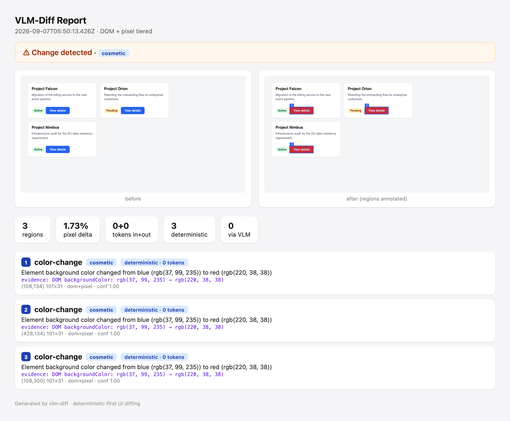
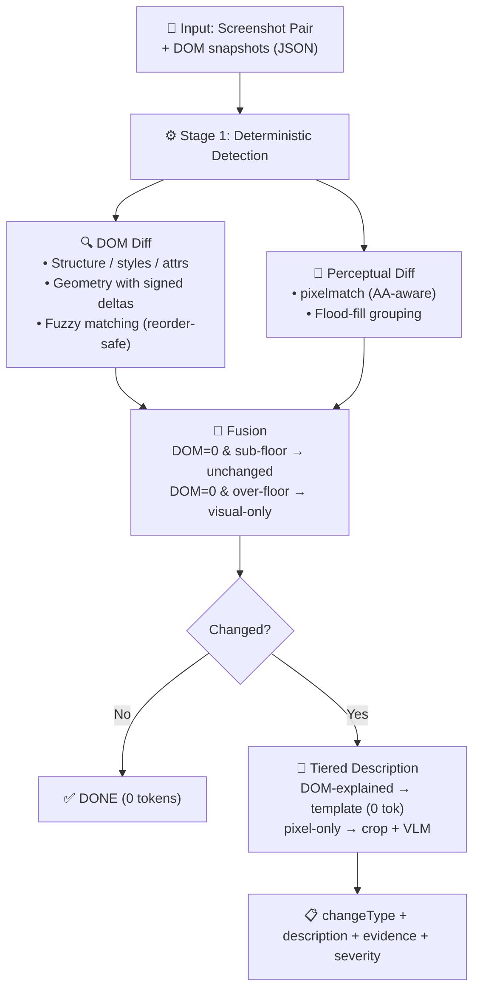

<div align="center">

# 👁 VLM-Diff

**The visual verifier for agentic coding workflows**

Did my UI change, and what exactly? — answered with DOM ground truth,<br/>
deterministic-first (zero tokens where the DOM explains the change),<br/>
severity tiers, and evidence you can check.

[](https://www.npmjs.com/package/vlm-diff)
[](LICENSE)
[](https://github.com/shidesheng0218/vlm-diff/actions/workflows/ci.yml)

[Quick Start](#-30-second-quick-start) · [How it works](#-how-it-works) · [Results](#-results-at-a-glance) · [GitHub Action](#-github-action) · [Agent recipes](docs/agent-recipes.md) · [Paper](paper/vlm-diff.tex) · [Changelog](CHANGELOG.md)

<br/>


<sub>Detection pipeline on five cases: changed regions are localized, typed, and described — mostly without any VLM call.</sub>

</div>

---

## ✨ Why vlm-diff

<table>
<tr>
<td width="33%">

### ⚡ Deterministic-first
The DOM diff already knows most of the answer — `rgb(37,99,235) → rgb(220,38,38)` becomes "background color changed from blue to red" from a template. **97% of regions never touch a model.**

</td>
<td width="33%">

### 🤖 Agent-native
An MCP server returns **typed `structuredContent` + the annotated frame as an image block** — coding agents verify their own UI edits and literally see the numbered regions.

</td>
<td width="33%">

### 🛡 CI gate, semantics included
CLI exit codes `0/1/2/3` and a composite **GitHub Action** that comments a severity table on the PR and uploads annotated HTML reports.

</td>
</tr>
<tr>
<td>

### 🧾 Evidence, not vibes
Every description carries the DOM values it was derived from (`backgroundColor: rgb(37,99,235) → rgb(220,38,38)`). You can check any claim against the raw evidence.

</td>
<td>

### 💰 Cost is a feature
Per-call cost log (fn, model, tokens, latency, $), budget gate (`VLM_DIFF_BUDGET_USD`), output caps, opt-in cheap-tier routing, content-hash cache.

</td>
<td>

### ♿ Accessibility layer
Deterministic WCAG contrast math flags drops below AA (`5.2:1 → 2.9:1`), and alt/aria removals are caught even with **zero pixel change**. Unique among visual-diff tools.

</td>
</tr>
</table>

---

## 🚀 30-second quick start

```bash
npm i -g vlm-diff

# capture the page before and after your change
vlm-diff snapshot http://localhost:3000 --out-dom before.dom.json --out-png before.png
# …make the change…
vlm-diff snapshot http://localhost:3000 --out-dom after.dom.json --out-png after.png

# diff: deterministic descriptions at 0 tokens, VLM only for pixel-only deltas
vlm-diff diff before.png after.png --dom-before before.dom.json --dom-after after.dom.json \
  --report report.html
```

```
⚠️  CHANGE DETECTED
   summary: Element background color changed from blue (rgb(37, 99, 235)) to red (rgb(220, 38, 38))
   type: color-change   severity: cosmetic
   evidence: DOM backgroundColor: rgb(37, 99, 235) → rgb(220, 38, 38)
```

No API key needed for DOM-observable changes — they are described deterministically. Pixel-only deltas (canvas repaints, image swaps) escalate to a VLM when a key is configured (`.env`: `DASHSCOPE_API_KEY`, `ANTHROPIC_API_KEY`, `OPENAI_API_KEY`, `MOONSHOT_API_KEY`, `OPENCODE_API_KEY`).

---

## 🧠 How it works

| Stage | What it does | Cost |
|---|---|---|
| **1 · Detect** | DOM diff (structure, styles, text, geometry, **attributes**) fused with perceptual pixel diff. DOM-unchanged + sub-noise-floor pixels ⇒ unchanged. | 0 tokens |
| **2 · Describe** | Regions the DOM fully explains get **template descriptions** — colors named, geometry signed ("moved 28px right"), lifecycle explicit, reflow followers attributed to their root cause. Nested moves merge into one logical change. | 0 tokens |
| **3 · Escalate** | Only pixel-only deltas (canvas repaints, SVG fills, image swaps) crop + classify via VLM — and a pair whose escalations all come back `none` flips back to unchanged, end-to-end honest. | cropped regions only |

<div align="center">

</div>

<sub>The `--report` output: before/after with numbered, severity-colored region boxes, and every region card carrying the DOM evidence its description was derived from.</sub>

<details>
<summary><b>Architecture diagram (mermaid) + full technical deep-dive</b></summary>



**Why DOM diff as ground truth?** Pixel diff alone flags 15–25% of unchanged pairs (anti-aliasing, focus rings, render timing). The DOM answers whether the page *model* changed. Thresholded suppression keeps the honest middle: above-floor pixel deltas with no DOM signal are *visual-only* and escalate — a pair flips back to unchanged only if the VLM calls every escalated region `none`.

**v0.3 structural upgrades.** Fuzzy DOM matching pairs nodes by stable key (unique `id`, else unique `tag|className|text`) so list reorders/head-inserts no longer fan out into phantom regions; semantic merging collapses a card and its children moving together into one logical change; deterministic severity tiers (`breaking` for element lifecycle + numeric text, `moderate` for large geometry/copy, `cosmetic` for color/style).

**Why crop-then-classify?** VLM-SubtleBench showed concatenating before/after hurts 9/10 categories; our own ablation showed plain crops lose the reference frame (56.7% conditional accuracy on Kimi without the DOM-field hint). The fix: pass the detector's changed fields as a ~50-token text prior — 83–90% recovered, and the tiered describer makes most regions free.

Remaining DOM-layer limits: CSS animations mid-frame, cross-origin iframes, and deltas below pixelmatch's own sensitivity (~0.15 YIQ) are invisible by construction.

</details>

---

## 📊 Results at a glance

**193-pair benchmark** (7 fixtures × 31 mutation types, incl. pixel-only canvas/SVG/image pairs and 42 no-change pairs), four arms, real API calls. Detection: **151/151 changed pairs, 0/42 false positives** (95% CI on FP: [0%, 8.4%]).

| Model | tiered: recall / FP / type-acc | tokens/pair | escalation | hint: type-acc | no-hint: type-acc | raw: recall / precision |
|---|---|---|---|---|---|---|
| **kimi-k3** (36 pairs) | 100% / 0% / **100%** | 11+4 | 1.3% | 93.3% | 56.7% | 76.7% / 82.6% |
| **qwen3.8-max** (36 pairs) | 100% / 0% / **100%** | 9+17 | 1.3% | 90.0% | 90.0% | 83.3% / 24.0% |
| **qwen3.8-max** (51 pairs, v0.2 subset) | 100% / 0% / **97.1%** [84.7%, 99.9%] | 112+131 | 18.7% | 91.2% | 85.3% | 85.3% / 37.9% |
| **qwen3.7-flash** (51 pairs, weak model) | 100% / 0% / **91.2%** [76.3%, 98.1%] | 112+127 | 23.6% | 35.3% | 26.5% | **0%** / — |

The weak-model row is the point: with a model whose raw full-image arm misses **every** changed pair (0% recall), the tiered pipeline still lands 100% recall and 91% type accuracy. **The robustness is architectural, not model-dependent.** A blind cross-vendor judge scores the zero-token templates on par with VLM descriptions (14/14/2, all bootstrap CIs straddling zero), and human calibration on all 30 judged pairs backs the aggregate read (66.7–80% per-pair agreement — judge is an aggregate instrument, not a per-pair one).

<details>
<summary><b>Full evaluation history: 15-pair three-arm MVP, 36-pair four-arm, blind judge, real-repo validation, original predictions</b></summary>

### MVP Validation (real API calls, 2026-08-19)

15-pair representative subset (5 subtle/boundary, 7 clear changes, 3 no-change), three arms: **rawPairToVlm** vs **fullPipeline (no hint)** vs **fullPipeline + DOM-field hint** — the detector's `changedFields` passed to the classifier as a ~50-token text prior. **Kimi K3** via Alibaba DashScope, two runs.

| Metric | rawPairToVlm | fullPipeline (no hint) | **fullPipeline + DOM hint** |
|--------|--------------|------------------------|------------------------------|
| **Recall** (12 changed pairs) | 66.7% (8/12) | 100% (12/12) | **100%** (12/12) |
| **FP rate** (3 no-change pairs) | 33.3% (1/3) | 0% | **0%** |
| **Classification accuracy** (among detected) | 100% (8/8) | 66.7% (8/12) | **83.3%** (10/12) |
| **End-to-end type accuracy** (of 12) | 66.7% (8/12) | 66.7% (8/12) | **83.3%** (10/12) |
| **Avg input tokens/pair** | ~1505 | ~583 | ~692 |

Findings: detection is reproducibly won by the pipeline (+33pp recall, 0% FP, byte-identical across runs while the raw arm fluctuated and produced a false positive); plain crop-then-classify is **refuted** (58.3–66.7% vs raw's 100% conditional); the DOM-field hint recovers the gap (+25pp/+16.7pp across runs) and wins end-to-end outright.

### Four-Arm MVP (real API calls, 2026-08-28)

36 pairs (30 changed + 6 no-change), Kimi K3, all four arms in one run. Total cost: **$0.18**.

| Metric | **tieredPipeline** | fullPipeline + hint | fullPipeline (no hint) | rawPairToVlm |
|--------|--------------------|---------------------|------------------------|--------------|
| **Recall** (30 changed) | **100%** [88.4%, 100%] | 100% | 100% | 76.7% [57.7%, 90.1%] |
| **FP rate** (6 no-change) | **0%** [0%, 45.9%] | 0% | 0% | 0% |
| **End-to-end type accuracy** | **100%** [88.4%, 100%] (30/30) | 93.3% (28/30) | 56.7% | 95.7% of detected (7 pairs missed) |
| **Avg tokens/pair** | **11 + 4** | 910 + 388 | 782 + 611 | 1505 + 196 |

The tiered arm wins on every axis — 74/75 regions deterministic (one pixel-only repaint band escalated), **98.9% fewer tokens** than the hinted pipeline, fixing both failure modes the hinted VLM arm made (a container's reflow growth out-voting an element-add; a border-color change mis-typed as style-change). McNemar (paired, same pairs): tiered vs raw recall significant (7/0, p=0.016); tiered vs hint type accuracy not significant (2/0, p=0.5); hint vs no-hint significant (11/0, p=0.001).

### v0.2 Live Re-Run (51 pairs, qwen3.8-max, 2026-09-02)

Four-arm protocol on the expanded 51-pair subset (34 changed — including all 4 pixel-only media pairs — and 17 no-change), per-pair error isolation + pair-level checkpointing. Total cost **$1.36**.

| Metric (95% CI) | **tieredPipeline** | fullPipeline + hint | fullPipeline (no hint) | rawPairToVlm |
|---|---|---|---|---|
| **Recall** (34 changed) | **100%** [89.7%, 100%] | 100% | 100% | 85.3% [68.9%, 95.0%] |
| **FP rate** (17 no-change) | **0%** [0%, 19.5%] | 0% | 0% | 0% |
| **End-to-end type accuracy** | **97.1%** [84.7%, 99.9%] | 91.2% | 85.3% | 79.4% |
| **Avg tokens/pair** | 112+131 | 737+1734 | 646+1320 | 1116+742 |

All 4 pixel-only media pairs classified correctly by the VLM tier; subset escalation 18.7% with **90.2%** token savings vs the hinted arm. The tiered arm's only type "miss" (`media-image-src-swap`) is a label-granularity artifact — the VLM wrote "the icon background changed from blue to red while the glyph and layout remained identical", factually correct, typed color-change vs ground truth `other`. McNemar: tiered vs raw recall 5/0 (p=0.063, same direction as v0.1's 7/0 at lower power).

### Blind Judge: template vs VLM description quality

Blind judge (qwen3.8-max judging Kimi K3's descriptions — different vendor, labels randomized, ground truth provided), 30 pairs:

| Dimension | tiered (template) | VLM |
|---|---|---|
| accuracy | 3.90 | **4.27** |
| specificity | **3.90** | 3.73 |
| readability | **4.60** | 4.50 |
| **winner** | **14** | **14** (+2 ties) |

Bootstrap CIs on the gaps (10k seeded resamples): accuracy Δ −0.37 [−0.80, +0.07], specificity Δ +0.17 [−0.47, +0.83], readability Δ +0.10 [−0.20, +0.40] — every dimension straddles zero. Human calibration on all 30 pairs (`data/judge-human-labels.json`): both descriptions correct on 27/30; the judge's vlm lean concentrates on the 3 factually wrong descriptions. Comparable quality at ~1% of the tokens.

### Real-World Validation (git-diff ground truth)

`scripts/validate-real-repo.ts` — two real open-source repos (mdn/beginner-html-site-styled, mdn/beginner-html-site-scripted), 6 commit-pair scenarios, zero API calls: **0 false positives, 0 misses**. An icon-file swap (same `` path, new pixels) escalated exactly as designed; a CSS refactor stayed 83% deterministic; `lang` attribute, font-protocol swap, and JS-only fixes were correctly reported as visually silent (the harness separates "source changed, pixels didn't" from true misses).

### Original predictions (for reference)

| Metric | rawPairToVlm | pixelDiffOnly | **fullPipeline** |
|--------|--------------|---------------|------------------|
| **Recall** | 70-75% | 92% ✓ | **92%** |
| **Precision** (IoU>0.3) | 30-40% | 85-90% | **88-92%** |
| **FP rate** (no-change) | 15-25% | 0% ✓ | **0%** ✓ |
| **Type classification accuracy** | 55-65% | N/A | **75-82%** |

✓ = confirmed on the real dataset. Hypothesis criteria: recall ≥+10pp (**+25pp** ✅), FP <20% (**0%** ✅), type accuracy ≥+15pp (crop-only **refuted**; with DOM hint **met**).

</details>

---

## 🧰 Usage

### CLI — diff any two screenshots

See the [quick start](#-30-second-quick-start). Reference highlights:

- Without `--dom-*` the CLI degrades to pixel-only mode (every significant delta escalates to the VLM).
- `--json` for machine-readable output; exit codes **0** no change / **1** changed / **2** error / **3** changed but needs a VLM key.
- `--no-vlm` runs detection + routing with zero API calls (escalated regions listed as pending).
- `--report <file.html>` writes the shareable annotated report shown above.
- API keys come from the environment or a local `.env`; `--provider`/`--model` override the preset.

### Baseline workflow (watch a project over time)

```bash
vlm-diff init http://localhost:3000/   # .vlm-diff/config.json (pages to watch)
vlm-diff baseline                       # golden snapshots → .vlm-diff/baseline/
# …later, after changes…
vlm-diff check                          # diff every page vs baseline, CI exit codes
vlm-diff review                         # approve changed pages (interactive; --approve-all in CI)
vlm-diff trends                         # change frequency + flaky-page detection from history
# or refresh everything explicitly (confirmation required):
vlm-diff baseline --yes
```

### MCP server (agents verify their own UI edits)

```bash
claude mcp add vlm-diff -- vlm-diff-mcp
```

Two tools over stdio: `snapshot_url` (capture a URL's DOM snapshot + screenshot) and `diff_screenshots` (the full tiered diff). Tool results include typed `structuredContent` and the **annotated after frame as an image block** — the agent literally sees the numbered, severity-colored regions. Integration recipes for Claude Code / Cursor / ZCode: [docs/agent-recipes.md](docs/agent-recipes.md). `npm run mcp:smoke` walks the full handshake offline.

### GitHub Action (gate PRs on visual severity)

```yaml
- uses: shidesheng0218/vlm-diff@v0.6.0
  with:
    fail-on: breaking        # breaking | any | never
    # provider: dashscope    # optional — only needed for pixel-only escalation
```

The composite action installs, builds, runs `vlm-diff check --json --report`, uploads annotated per-page HTML reports as an artifact, and comments a severity table on the PR. Same exit-code contract as the CLI: errors always fail, changes fail per `fail-on`, "needs a VLM key" warns without failing. Verified live on a real PR (comment + artifact + correct gate).

### Demos & evaluation workflow (for contributors)

```bash
npm run demo:quick      # real algorithm on synthetic in-memory inputs (no keys)
npm run demo:generate   # render 3 demo pairs with Playwright
npm run demo:detect     # deterministic detection on them
npm run dataset:gen     # regenerate the 193-pair dataset
npm test                # 212 unit tests, zero API calls
npm run eval:mvp        # four-arm live eval on the 51-pair subset (needs a key)
npm run stats:report    # CIs + McNemar + bootstrap over any report
npm run compare:models  # cross-model table from all reports
```

---

## 💰 Cost & trust

Every provider is wrapped in an instrumented layer:

- **Cost log** — every VLM call appends one JSON line to `.cache/cost-log.jsonl`: `{ts, fn, provider, model, tokens, latencyMs, costUsd, ok}`. Per-feature spend is answerable with `jq`.
- **Output caps** — per-call `maxTokens` (classification 512, judges/raw 1024).
- **Budget gate** — `VLM_DIFF_BUDGET_USD=0.50` fails fast past the cap.
- **Model routing (strictly opt-in)** — `VLM_DIFF_CLASSIFY_MODEL` sends high-volume classification to a cheaper tier; nothing routes unless set.
- **Timeouts + retry** — 120s per call, inside the retry layer, so a hang is a retryable failure, not a stalled run.
- **Cache** — content-hash over crop pixels + prompt + model identity (switching models can never return another model's verdict).

**Data handling & privacy.** Only cropped before/after *regions* (never full pages) plus a short DOM-field hint leave your machine, sent to the model API you configured. Keys, full screenshots, DOM snapshots, and baselines never leave it. State lives in `.vlm-diff/` and `.cache/` (both gitignored); there is no telemetry, no accounts, no server of ours.

---

## 🗂 Dataset

**193 screenshot pairs** — 7 fixtures (card grid, form, navbar, table, modal, dashboard, and a media page with canvas/SVG/img widgets) × 31 mutation types. Detection: **151/151 changed pairs, 0/42 false positives** (FP CI [0%, 8.4%]).

Each pair: before/after PNGs (960×500), DOM snapshots (path/tag/id/class/text/rect + 7 computed styles + whitelisted attributes), ground-truth rect, kind, and natural-language ground truth.

<details>
<summary><b>Full mutation breakdown + dataset design notes</b></summary>

| Mutation category | Count | Example |
|---|---|---|
| Spatial shift (3–28px) | 31 | margin/transform moves; includes 2 list-reorder pairs (fuzzy matching) |
| Color change (bg/text/border/contrast) | 31 | `#2563eb` → `#dc2626`; 5 contrast-degrade pairs (a11y) |
| Size change (scale 0.9×–1.35×) | 25 | CSS transform scaling |
| Text change (similar/different/shorten/numeric/alt) | 23 | "Project Falcon" → "Project Falcan"; alt removal (zero-pixel change) |
| Element add / remove | 18 | clone or delete a card/row/button |
| Style change (weight/radius/shadow/opacity) | 22 | bold → normal, rounded → square |
| Pixel-only (canvas ×2, SVG fill, image swap) | 4 | zero DOM signal — the VLM escalation path |
| Other | 1 | — |
| **No-change** | 42 | re-render / reload / settle-time variants |

The v0.1 dataset was DOM-observable by construction (escalation circularity); the pixel-only category and the 42 no-change pairs fix the two biggest holes (the FP CI upper bound dropped from ≈46% at n=6 to ≈8% at n=42). Since v0.6, attribute changes (src/href/alt/aria) are captured, which moved the image-swap pair from the escalation path into the deterministic tier.

</details>

---

## 📉 Limitations & roadmap

**Resolved recently**: pixel-only blind spot (thresholded suppression + escalation, v0.2) · tiny FP denominator (42 no-change pairs, v0.2) · escalation circularity (real-repo validation, v0.2) · point estimates without CIs (v0.2) · uncalibrated judge (human calibration, v0.2) · reorder explosions (fuzzy matching, v0.3) · invisible attributes (attribute capture, v0.6).

**Still open**: third-party widgets (ads/chat/maps) whose pixels change independently of your code · synthetic fixtures dominate (6 real-repo scenarios are a start, not a benchmark) · Chromium only · judge is an aggregate instrument only · sub-sensitivity changes below pixelmatch's threshold are invisible · Claude/GPT-class replication pending an API key (Kimi/Qwen evidence stands).

<details>
<summary><b>Roadmap</b></summary>

- **Phase 1 ✅** research prototype validates the hypothesis
- **Phase 2 ✅ (v0.2)** usable tool — CLI, MCP, expanded dataset, statistical rigor
- **Phase 3 ✅ (v0.3–v0.5)** structural understanding, trust & cost layer, agent verifier + GitHub Action
- **Phase 4 ✅ (v0.6)** attribute awareness, deterministic a11y, review/trends loop
- **Next**: specialist model fine-tuned on the deterministic tier's free labels (652 exported — see `docs/specialist-model.md`); GitHub Marketplace listing; Claude/GPT-class replication.

</details>

---

## 🔬 For researchers

Paper draft: [paper/vlm-diff.tex](paper/vlm-diff.tex) · writeups: [Dev.to](https://dev.to/shidesheng/building-a-visual-regression-tool-with-vlms-and-dom-diffing-1j4m) · [掘金](docs/juejin-article.md) · competitive analysis: [docs/marketing/COMPETITIVE_ANALYSIS.md](docs/marketing/COMPETITIVE_ANALYSIS.md)

<details>
<summary><b>Citation</b></summary>

```bibtex
@software{vlm_diff_2026,
  title={VLM-Diff: Visual Regression Detection with Structural Ground Truth},
  author={shidesheng},
  year={2026},
  month={September},
  version={0.6.0},
  url={https://github.com/shidesheng0218/vlm-diff},
  note={Deterministic-first UI diffing with tiered VLM escalation: CLI, MCP server, dataset, and evaluation framework}
}
```

</details>

<details>
<summary><b>References</b></summary>

- **VLM-SubtleBench** (March 2026): [arXiv:2603.07888](https://arxiv.org/abs/2603.07888) — 13K near-identical image pairs, frontier VLM accuracy 62–78%
- **OmniDiff** (March 2026): [arXiv:2503.11093](https://arxiv.org/abs/2503.11093) — fine-tuned specialist 6× better than GPT-4o zero-shot
- **WUICC-bench** (July 2026): [arXiv:2607.01728](https://arxiv.org/abs/2607.01728) — first UI visual regression benchmark
- **Applitools MCP** (January 2026): [blog post](https://applitools.com/blog/add-visual-testing-to-your-ai-workflow-with-the-applitools-mcp-server/)
- **Chain-of-Focus** (May 2026): [arXiv:2505.15436](https://arxiv.org/abs/2505.15436) — VLM iterative attention
- **SPARC** (February 2026): [arXiv:2602.06566](https://arxiv.org/abs/2602.06566) — two-stage visual search + reasoning

</details>

<details>
<summary><b>Release history</b></summary>

- **v0.6** — attribute-aware capture (image swaps/link targets now deterministic), deterministic a11y (WCAG contrast + alt/aria), `review` + `trends` workflow
- **v0.5** — agent verifier: MCP image blocks + structuredContent, GitHub Action, `check --json/--report`
- **v0.4** — trust & cost: evidence everywhere, baseline overwrite confirmation, cost log, budget gate, timeouts, output caps
- **v0.3** — fuzzy DOM matching, region merging, severity tiers, annotated HTML report, baseline workflow
- **v0.2** — CLI + MCP, thresholded suppression, 42 no-change pairs, statistics layer, real-repo validation

Full details in [CHANGELOG.md](CHANGELOG.md).

</details>

---

<div align="center">
<sub>Built by <a href="https://github.com/shidesheng0218">shidesheng</a> · MIT License · <a href="QUICKSTART.md">Quick start guide</a> · <a href="docs/publish.md">Publishing checklist</a></sub>
</div>
